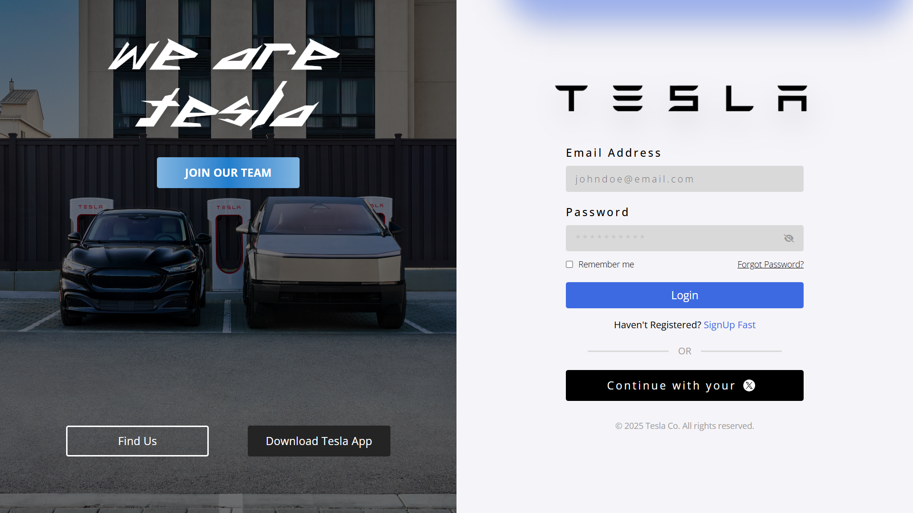

# TeslaLoginPage

Fully Responsive Login/Signup Page for A Company Like Tesla

## Description

This project is a fully responsive login and signup page designed for a company like Tesla. It uses modern web technologies such as HTML, CSS, and Tailwind CSS to create a sleek and user-friendly interface.

## Features

- Responsive design for both desktop and mobile devices
- Custom fonts and icons
- Login and signup forms
- Tesla branding section with background images and buttons
- Remember me and forgot password options
- Continue with X button

## Technologies Used

- HTML
- CSS
- Tailwind CSS
- Font Awesome

## Usage

1. Clone the repository
2. Open `index.html` for the login page
3. Open `signup.html` for the signup page

## Preview

Login Page:

Signup Page:

## License

This project is licensed under the Apache License 2.0. See the [LICENSE](LICENSE) file for details.

## Support
Free free to fork/start or to contribute on the repository and make sure to follow [Diwas Atreya](https://github.com/diwasatreya)